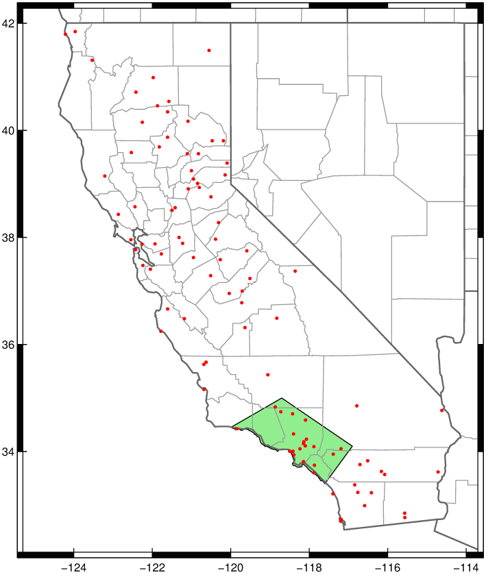

###Tracking rainfall during the 2016-2017 water year

There are two elements contained in this repo. The first is a chart ([live here](http://projects.scpr.org/charts/rainfall-2017/)) that shows how weighted precipitation totals this year, along with the median precipitation and median precipitation of just the past five strong La Niña 'water years'. This data comes via [David Pierce of Scripps](http://cirrus.ucsd.edu/~pierce/sdprecip/). The raw data is updated daily [at this link](http://cirrus.ucsd.edu/~pierce/kpbs/). KPCC uses the file make_indices_v6.LA_basin.365.out.cumul.txt.

The second element is a 'gauge' that shows the most recent precipitation percent. This is only the single most recent data point from the chart. The code for the gauge [was based on this neat open-source liquid fill gauge](http://bl.ocks.org/brattonc/5e5ce9beee483220e2f6).

Should you want to embed it, here's an iframe you can copy:

<iframe frameborder = 0 height = 500 width = 100% src="http://projects.scpr.org/charts/rainfall-2017/gauge/"></iframe>

I plan these updated throughout the winter storm season, and the full water year as storms come through the region. Questions, comments, criticism to amendelson AT scpr DOT org

The weather stations reflected in these measurements are the ones in the green box below:

