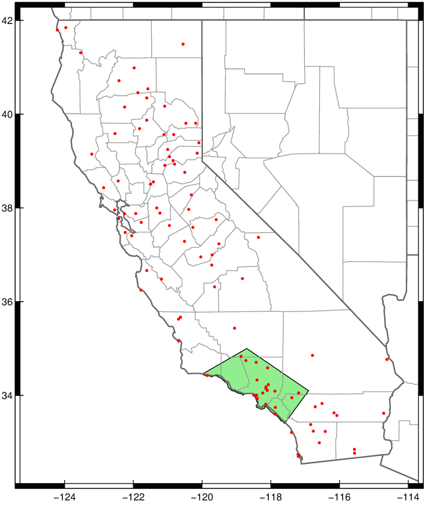

###Tracking rainfall during the 2015-2016 water year

Which, in case you've been living under a rock, is an El Niño year.


There are two elements contained in this repo. The first is a chart ([live here](http://projects.scpr.org/charts/water-year-rainfall-to-date/)) that shows how weighted precipitation totals this year, along with the median precipitation and median precipitation of just the past five strong El Niño 'water years'. This data comes via [David Pierce of Scripps](http://cirrus.ucsd.edu/~pierce/sdprecip/). The raw data is updated daily [at this link](http://cirrus.ucsd.edu/~pierce/kpbs/). KPCC uses the file make_indices_v6.LA_basin.365.out.cumul.txt. We use an R script that can download the data and then format the 2015/16 totals, median, and Niño-year median in a Highcharts-friendly format.

The second element is a 'gauge' that shows the most recent accumulated end of winter precipitation percent. This is only the single most recent data point from the chart, but the one that we surmise will attract the most interest. The code for the gauge [was based on this neat open-source liquid fill gauge](http://bl.ocks.org/brattonc/5e5ce9beee483220e2f6).

Should you want to embed it, here's a possible iframe for you:

```
<iframe frameborder = 0 height = 500 width = 100% src="http://projects.scpr.org/charts/water-year-rainfall-to-date/gauge/"></iframe>
```

We're trying to keep these updated throughout the winter storm season, and the full water year as storms come through the region. Questions, comments, criticism to amendelson AT scpr DOT org

The weather stations we're tracking are the ones in the green box below:


